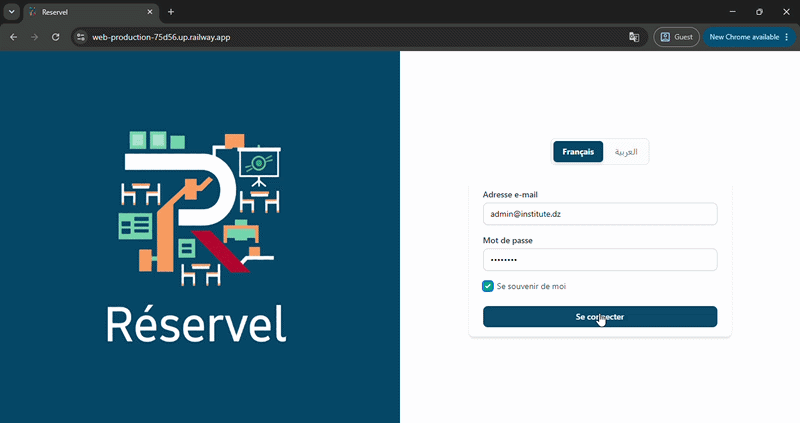

<div align="center">

# Reservel

Full-stack academic resource reservation platform with role-based auth, conflict-aware booking, maintenance tracking, and full Arabic/French RTL support.

**[Live Demo →](https://web-production-75d56.up.railway.app/)**



</div>

---

## Overview

Reservel centralizes room and equipment reservations (IT, cybersecurity, biology labs) for an academic institute, replacing manual scheduling that led to double-bookings and no visibility into equipment health. Admins and teachers get separate dashboards, and every asset moves through an automated lifecycle: available → reserved → in use → available, with an equipment fault report able to pull it out of circulation instantly.

## Features

- **Role-based access** — separate Admin and Teacher dashboards via Laravel Breeze
- **Conflict-aware booking** — server-side availability checks before any reservation is confirmed
- **Asset lifecycle automation** — resources auto-transition between available, reserved, in-use, and under-maintenance states
- **Fault reporting** — teachers can flag broken equipment; flagged assets are automatically removed from the booking pool
- **Full bilingual support (FR/AR)** — including dynamic RTL layout switching, not just translated strings
- **Responsive design** — tested down to mobile, including RTL layout switching on smaller screens
- **Admin analytics** — asset counts, reported faults, and booking stats on the dashboard

## Tech Stack


## Architecture

Standard Laravel MVC:

```
reservel/
├── app/
│   ├── Http/Controllers/   — AssetController, BookingController, ReportController
│   └── Models/             — Asset, Booking, Report, User (Eloquent relations)
├── resources/views/        — Blade templates (assets, bookings, components)
└── routes/web.php
```

Booking conflict checks and asset lifecycle transitions run through a dedicated `BookingService`, with Eloquent query scopes used to filter available resources.

## Demo Credentials

Live demo is seeded with the following accounts (password: `password` for all):

| Role | Name | Email |
|---|---|---|
| Admin | Dr. Mourad Mezache | `admin@institute.dz` |
| Teacher | Prof. Lydia Idir | `lydia.idir@institute.dz` |
| Teacher | Prof. Bachir Saaidia | `bachir.saaidia@institute.dz` |
| Teacher | Prof. Amel Afia | `amel.afia@institute.dz` |
| Teacher | Prof. Sihem Aimeur | `sihem.aimeur@institute.dz` |
| Teacher | Prof. Karim Benali | `karim.benali@institute.dz` |
| Teacher | Prof. Fatima Zohra | `fatima.z@institute.dz` |

## Getting Started

```bash
git clone https://github.com/riverimenemessadh/Reservel.git
cd Reservel
composer install
npm install
cp .env.example .env
php artisan key:generate
```

Configure your database in `.env`, then:

```bash
php artisan migrate --seed
npm run build
php artisan serve
```

## Contact

- [Portfolio](https://rivermessadhportfolio.netlify.app/)
- [LinkedIn](https://www.linkedin.com/in/river-messadh)
- [Upwork](https://www.upwork.com/freelancers/~017d459f20e3d30e04)
- [Email](mailto:sarahimenemessadh@gmail.com)
